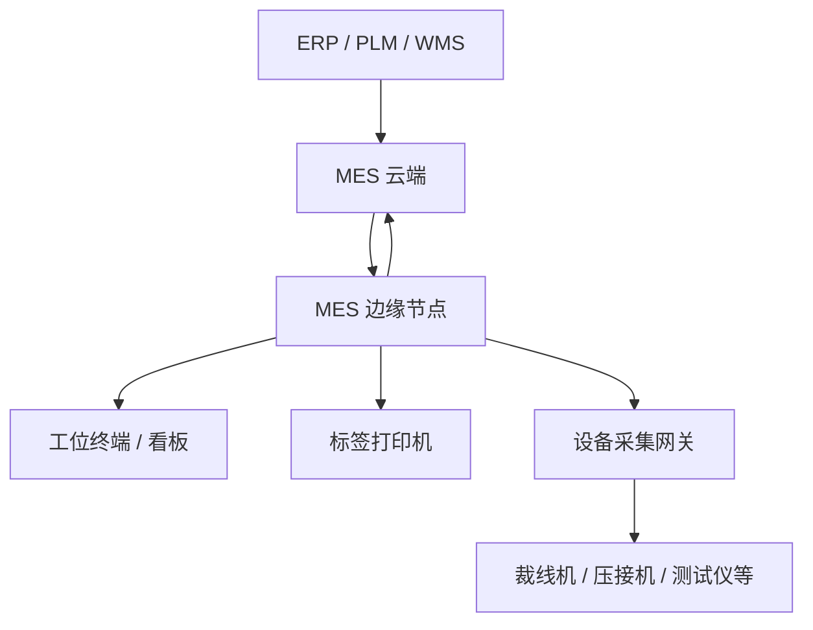
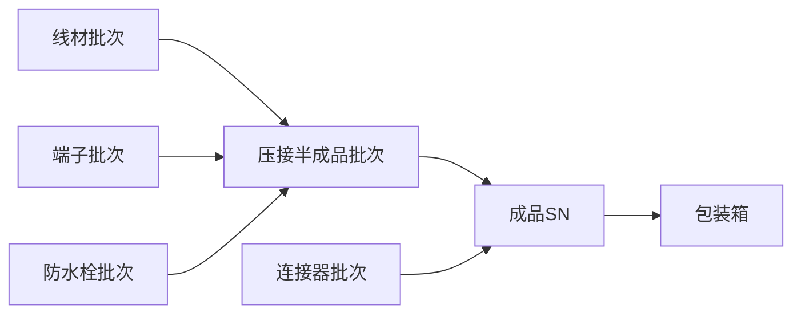
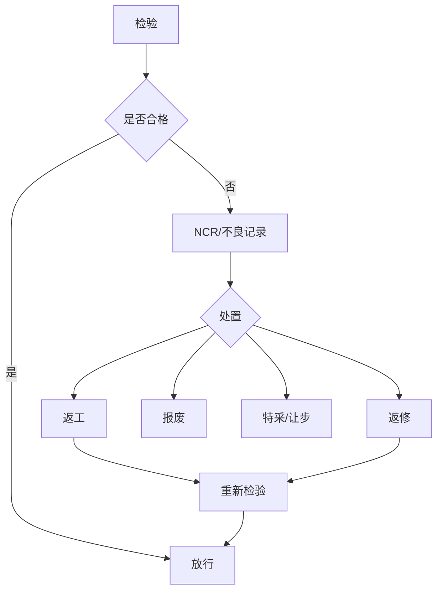

# 线束 MES 完整预研资料 · Wiki 合订版

> 本文件由 Wiki 各主题页按顺序合并，适合作为 AI/Codex 项目上下文。  
> 详细原始预研文档仍保存在 `sources/`，Wiki 分页版本位于 `docs/`。

---

# 00 · MES 总览与预研地图

**状态：综合总览 / 基线**

## 1. 项目定位

本项目是面向线束制造行业的 MES 产品，核心目标不是替代 ERP、WMS、PLM 或 QMS，而是把“计划下达到生产完成”之间的现场执行过程数字化、可防错、可追溯、可分析。

核心价值：

- 工单执行透明化；
- 工序与物料防错；
- 质量数据在线闭环；
- 人、机、料、法、环、测形成生产履历；
- 原材料批次到成品 SN 的正反向追溯；
- 断网不停产；
- 多工厂集中治理；
- 设备逐步联网，形成自动采集与闭环控制能力。

## 2. 产品边界

MES 负责：工单执行、工艺实例、工序流转、扫码防错、生产报工、质量记录、物料现场消耗、设备事件关联、标签、追溯、异常、现场看板。

ERP 负责：销售订单、采购、财务库存账、成本、主计划等企业经营管理。

WMS 负责：库位、库存移动、收发存、仓储作业。

PLM/工艺系统负责：产品设计与工程BOM等上游工程数据；MES接收可生产版本。

## 3. 总体逻辑架构



### 云端

负责主数据、工艺版本、工单计划、跨工厂管理、历史归档、分析报表、ERP集成、版本发布、设备/边缘节点治理。

### 边缘

负责扫码、防错、报工、检验、追溯事件落盘、标签、现场看板、本地用户权限、离线运行。

### 数据所有权

- 生产事件：边缘产生原件，云端保存副本；
- 主数据：云端维护原件，边缘保存版本化副本；
- 避免同一业务对象在云边两端同时写。

## 4. 核心业务链


## 5. 预研分层

### 第一层：核心业务模型

01 工艺路线、07 领域模型、08 追溯、09 质量、10 状态机、11 物料、15 异常。

### 第二层：现场执行技术

02 扫码/并发/离线/权限/编码/性能、05 标签、06 设备接入。

### 第三层：平台架构

03 云边、04 更新、13 组织权限、16 运维、17 安全、18 灾备、21 配置、22 版本。

### 第四层：外围集成

12 ERP、14 APS、19 WMS/QMS/PLM/IoT边界。

### 第五层：产品化

20 实施、23 数据生命周期、24 测试验收、25 路线图。

## 6. 当前优先级

P0：07、08、09、10、11、12。  
P1：13、15、16、17、18。  
P2：14、19、20、21、22、23、24。

原因：核心业务对象如果没有稳定，后续数据库、API、云边同步、设备数据和追溯都会反复修改。


---

# 01 · 工艺路线与工序灵活配置

**状态：基线，来源 PRE-01**

## 1. 核心结论

线束行业工艺差异是“行业模板 + 有界变体”，不应把标准 7 工序写死，也不应在阶段一做万能 BPM 流程引擎。

标准骨架可包含：裁线下线 → 压接 → 预装 → 总装 → 导通测试 → 外检 → 包装入库；汽车、家电、工业线束通过特殊工序和检验深度形成变体。

## 2. 四个配置层次

1. **工序级**：编码、名称、类型、关键工序、SOP；
2. **流转级**：顺序、前置、跳过、并行、返工；
3. **工序内**：扫码点、防错规则、检验项、采集字段、人员资质；
4. **工单级**：路线版本、临时调整、追溯粒度、客户特殊要求。

## 3. 能力分级

- L1：行业模板预置；
- L2：表单式有限配置 + 路线版本；
- L3：图形化分支/并行/回流；
- L4：规则引擎动态路由。

阶段一目标：**L1 + L2**。

## 4. 核心设计

### 模板 → 实例

工单创建/下发时，将工艺路线模板版本实例化为 WorkOrderRouting / WorkOrderOperation。模板后续升级不影响在制工单。

### 在制锁定

- 新工单使用新版本；
- 已下发/已开工工单继续使用旧实例；
- 临时调整必须受控并留审计记录。

### 流转原则

阶段一默认强制顺序 + 完工确认；可跳过必须配置并记录原因；返工走受控返工链路。

## 5. 需要与其他课题联动

- 07：Operation、Routing、RoutingVersion 领域模型；
- 09：每个 Operation 可绑定 InspectionPlan；
- 10：工单/工序状态机；
- 11：工序投料点和物料防错；
- 06：工序与设备类型/采集点绑定；
- 21：工艺发布、灰度和版本下发。


---

# 02 · MES 关键技术要点

**状态：基线，来源 PRE-02**

## 1. 扫码

阶段一以 HID 键盘模拟为主，隐藏输入框/全局监听捕获扫码；5 秒内同码防重；焦点自动恢复。多枪同 PC 需要串口或设备级识别方案。

## 2. 并发

- 工单状态：乐观锁；
- 工序生产数据：事件追加；
- 物料扣减：前置余量校验 + 乐观锁；
- 看板：从生产事件聚合，不依赖易冲突的单一状态字段。

核心原则：**生产事实以不可变事件记录，状态是事件聚合结果。**

## 3. 离线

原 PRE-02 的轻量离线思路已被 PRE-03 深化为边缘服务器架构：现场核心功能全部本地闭环，断公网仍可生产。

## 4. 标签打印

TCP/IP 9100 + ZPL II；模板数据库化；按产品/标签类型绑定；重打必须记录原因、次数和操作人。详见 PRE-05。

## 5. 权限与数据隔离

RBAC + 行级组织权限。业务表从第一天带 factory_id，必要时 workshop_id/line_id/workstation_id。

## 6. 追溯

采用事件驱动 + Genealogy/DAG 思路，生产数据不通过“工单表里几个批次字段”表达。详见 PRE-08。

## 7. 编码

编码应区分业务主键、展示编码、条码内容；避免把可变业务含义过度编码进主键。SN、批次、工单、标签均需明确唯一性范围和生成端。

## 8. ERP 集成

ERP 是计划与财务库存账来源，MES 是现场生产事实来源；采用 Adapter 层隔离不同 ERP。详见 PRE-12。

## 9. 性能与可用性

关注扫码响应、批量同步、热点聚合、历史归档、索引、事件表增长、看板缓存、边缘断网容量。优先保障“现场操作无感知”。


---

# 03 · 云边协同架构

**状态：基线，来源 PRE-03**

## 1. 黄金法则

> 拔掉网线后，如果工人无法扫码、看工单、报工、检验、打印，则该能力必须在边缘运行。

## 2. 边缘职责

工单执行、扫码防错、质量录入、现场看板、追溯事件落盘、标签打印、BOM/工艺/物料主数据缓存、本地登录权限、工位/打印机/设备配置。

## 3. 云端职责

主数据维护与发布、多工厂管理、ERP工单接入、历史归档、分析报表、ERP回传、全局配置、开放API、边缘节点/版本管理。

## 4. 同步机制

### 云 → 边缘

主数据版本号驱动 + 边缘定时拉取增量。避免依赖云端主动推送；版本号避免时钟偏差。

### 边缘 → 云

生产事件先写边缘 DB，同时进入 sync_queue；sync-agent 批量上报。每条事件使用 event_id 幂等去重，确认后标记 synced，不删除本地原始事实。

## 5. 离线恢复

断网不阻塞 MES 主业务；sync_queue 累积，联网后按顺序补传。管理端显示边缘离线与数据滞后状态。

## 6. 边缘技术形态

阶段一推荐 Linux 工控机 + 单体 MES 应用 + 独立同步守护进程，数据库使用 PostgreSQL 更适合复杂查询、并发和长期演进。

## 7. 冲突原则

通过单向数据所有权减少冲突：

- 生产事实边缘优先；
- 主数据云端优先；
- 工单下发后涉及取消、数量修改必须考虑边缘真实执行状态。


---

# 04 · 边缘节点程序远程更新

**状态：基线，来源 PRE-04**

## 1. 目标

阶段一允许首次上门实施，但从第一天具备远程日常升级能力，避免客户数量增加后被逐家现场运维拖垮。

## 2. 进程

- mes-app：MES现场业务；
- sync-agent：云边数据同步；
- update-agent：升级火种进程；
- device-gateway：阶段二设备采集进程。

## 3. 安全升级

发布 → 指定设备/分组 → 时间窗口下载 → SHA256/签名校验 → DB备份 → 停服务 → 部署/迁移 → 启动 → 健康检查 → 成功确认或自动回滚。

## 4. A/B 思路

使用 `/opt/mes/releases/vX.Y.Z` + `current` 软链接；data 与代码分离；始终保留至少一个可运行旧版本。

## 5. Schema 迁移原则

- 脚本随版本走；
- 更新前备份；
- 尽可能 Expand/Contract，而不是破坏性变更；
- 迁移幂等；
- 应用启动校验 schema 兼容范围；
- 回滚必须明确 DB 是否可逆。

## 6. 生产保护

默认非生产时间窗口；在制工单检查；灰度发布；失败设备停止自动重试并进入人工处理。


---

# 05 · 标签打印体系

**状态：拆分整理，来源 PRE-02 标签打印章节**

## 1. 标签类型

看板标签、端子标签、成品 SN 标签、合格证、包装标签。

## 2. 架构原则

MES 决定“何时打、打什么”，打印机负责“怎么打”。打印机 IP、端口、指令集、模板绑定均数据化配置。

## 3. 阶段一

- TCP/IP 9100；
- ZPL II 优先；
- 模板存储变量占位符；
- 工序事件触发打印；
- 打印前状态校验；
- 打印后记录 PrintJob / PrintLog；
- 重打要求原因与权限。

## 4. 数据模型建议

- label_template：模板、版本、标签类型、尺寸；
- printer：工厂/工位、IP、端口、状态；
- label_binding：产品/客户/工序与模板绑定；
- print_job：请求、状态、重试次数；
- print_log：实际打印、操作人、重打原因。

## 5. 关键风险

打印成功无法仅凭 TCP 发送成功判定“物理标签已打印”；阶段二可通过支持状态回读的打印机、打印队列或人工确认增强可靠性。


---

# 06 · 设备对接协议适配库

**状态：基线，来源 PRE-06**

## 1. 架构决策

阶段二采用“设备 → 边缘设备采集网关 → MES”，不让 MES 业务应用直接承担大量厂商协议；阶段二暂不引入独立 IoT 数据中台。

## 2. 网关职责

协议解析、采集、清洗、时间戳统一、本地缓存、标准化输出；不负责工单绑定、质量最终判定、追溯业务规则。

## 3. 协议范围

高端设备可能提供 OPC UA、REST、MQTT、WPCS/厂商标准接口；中低端常见 RS232、Modbus、TCP/ASCII、文件导出或私有协议；老旧设备可能需要 I/O、串口改造或旁路传感。

## 4. 四层适配

1. Transport：Serial/TCP/UDP/HTTP；
2. Protocol：Modbus/OPC UA/ASCII/私有协议；
3. Adapter：厂商/型号插件；
4. UDM：统一设备数据模型。

## 5. 数据采集分级

- L1 状态采集：运行/停机/报警/计数；
- L2 参数回传：工艺参数、质量测量值；
- L3 闭环控制：工单/配方/参数下发与互锁。

阶段二优先 L1 + 关键设备 L2。

## 6. 统一设备事件建议

至少包含：device_id、event_id、event_type、device_time、received_time、sequence、payload、quality、raw_ref。


---

# 07 · MES 核心领域模型

**状态：建议稿 / P0**

## 1. 为什么优先做

现有预研已共同依赖产品、BOM、工艺、工单、工序实例、报工、批次、SN、质量、设备事件。若对象边界不稳定，数据库、API、同步和追溯都会反复返工。

## 2. 建议领域划分

```text
Organization  Factory / Workshop / Line / Workstation / Shift
MasterData    Product / Material / BOM / Employee / Equipment
Process       Operation / Routing / RoutingVersion / SOP / ParameterSpec
Production    WorkOrder / WorkOrderOperation / ProductionBatch / Report / Event
Material      MaterialBatch / Feeding / Consumption / Return
Quality       InspectionPlan / InspectionRecord / Defect / Disposition / Rework
Traceability  ProductSN / TraceEvent / GenealogyRelation
Equipment     Device / DeviceEvent / DeviceParameter / DeviceAlarm
```

## 3. 聚合边界建议

### WorkOrder 聚合

保存计划身份和执行约束，不承载所有生产明细。工序执行事实通过 WorkOrderOperation + ProductionEvent 表达。

### Routing 聚合

模板按版本不可变发布；工单生成路线实例后与模板解耦。

### ProductionEvent

生产事实统一事件化：START、PAUSE、RESUME、COMPLETE、MATERIAL_FEED、INSPECTION、DEFECT、REWORK、DEVICE_CAPTURE 等。

### GenealogyRelation

表达“输入对象 → 输出对象”，对象可为物料批次、半成品批次、SN、包装单元。

## 4. 主键与业务编码

数据库主键与业务编码分离。推荐使用全局唯一 ID/UUID/雪花 ID 作为内部主键，工单号、批次号、SN 独立字段并建立业务唯一约束。

## 5. 多工厂维度

核心业务表至少具备 tenant_id（若未来SaaS）、factory_id；现场表按需带 workshop_id、line_id、workstation_id。

## 6. 时间字段规范

区分：event_time、device_time、received_time、created_at、synced_at，不用一个 create_time 表达所有时序语义。

## 7. 下一步输出物

- 领域上下文图；
- 核心 ER 图；
- 聚合根定义；
- 事件字典；
- ID/编码规范；
- 数据所有权矩阵。


---

# 08 · 批次 / SN / Genealogy 全链路追溯

**状态：建议稿 / P0**

## 1. 目标

实现原材料批次 → 半成品 → 成品 SN → 包装/交付的正向追溯，以及客户投诉 SN → 工序 → 人员 → 设备 → 参数 → 物料批次 → 检验结果的反向追溯。

## 2. 为什么是图而不是单表

线束由多种物料和半成品汇聚形成，生产过程存在一对多、多对一、拆批、合批和返工，因此应以 Genealogy 关系表达谱系。



## 3. 追溯实体

- material_batch；
- production_batch；
- product_sn；
- genealogy_relation；
- production_event；
- material_consumption；
- inspection_record；
- device_event_ref；
- package_unit。

## 4. 批次切换

必须记录物料批次生效区间，不能只在工单级记录“用过哪些批次”。对连续生产，可通过 event_time / sequence 将物料批次切换与产出 SN/批次关联。

## 5. 追溯查询

### 正向

原料批次 → 使用工单/工序 → 半成品/成品 → 包装 → 交付范围。

### 反向

SN → 工单 → 路线版本 → 工序事件 → 操作人/工位/设备 → 物料批次 → 检验与过程参数。

## 6. 不可变性

原始追溯事件原则上只追加，不物理覆盖。纠错使用 correction/reversal 事件并保留原记录。

## 7. 性能

高频事件表按时间/工厂分区；Genealogy 建双向索引；常用 SN 查询建立物化摘要或缓存，但原始事件作为事实源。


---

# 09 · 质量管理与不合格品闭环

**状态：建议稿 / P0**

## 1. 质量对象

InspectionPlan、InspectionItem、InspectionTask、InspectionRecord、Defect、NCR、Disposition、ReworkOrder、QualityRelease。

## 2. 检验类型

首件检验、巡检、完工检、设备自动检测、抽检、全检、返工复检。

## 3. 闭环



## 4. 过程参数与质量判定分离

设备上传的压接高度、压力曲线、拉脱力、导通、绝缘、耐压等属于测量/过程数据；最终 Pass/Fail 由版本化规格与判定规则产生。必须保留原始值、规格版本和判定结果。

## 5. 关键字段

spec_version、lower_limit、upper_limit、measured_value、unit、result、equipment_id、operator_id、event_time、source(manual/device)、retest_of。

## 6. 放行与冻结

不合格对象进入 HOLD，未经授权处置不得继续流转；特采必须具备角色权限、原因、审批人和审计记录。

## 7. 质量统计基础

一次合格率 FPY、缺陷率、返工率、报废率、工序不良 Pareto、设备/班组/产品质量趋势。


---

# 10 · 工单与工序执行状态机

**状态：建议稿 / P0**

## 1. 两级状态机必须分离

工单状态反映整体执行；工序状态反映某一道工序。不能用单一 work_order.status 表达所有现场状态。

## 2. 工单建议状态

DRAFT → RELEASED → DISPATCHED → READY → RUNNING → COMPLETED → CLOSED。

旁路：HOLD、CANCELLED。生产开始后取消需受限，必要时改为 STOPPED/ABORTED 并保留已发生事实。

## 3. 工序建议状态

WAITING → READY → RUNNING → COMPLETED。

旁路：PAUSED、SKIPPED、FAILED、HOLD、REWORKING。

## 4. 状态变更来源

状态不能只靠页面按钮 UPDATE；应由命令产生事件，再由事件驱动状态投影。关键命令：release、dispatch、start、pause、resume、complete、hold、cancel、rework、close。

## 5. 数量维度

计划数、投入数、完工数、合格数、不良数、报废数、返工中数量应分开。状态与数量不能互相替代。

## 6. 修改规则

- 未下发：可修改计划；
- 已下发未开工：可受控变更并重新同步；
- 已开工：禁止无痕修改计划关键字段；
- 已完成：通过补充/冲销/返工等业务单据调整，不直接改历史。


---

# 11 · 生产物料执行模型

**状态：建议稿 / P0**

## 1. 边界

ERP/WMS 维护财务库存账和仓储位置；MES 记录生产现场“实际投入和实际消耗事实”。

## 2. 业务动作

备料、上线、投料、换料、补料、退料、消耗、损耗、余料、批次切换、替代料、超领。

## 3. 防错

扫码物料后校验：BOM 物料、替代规则、批次状态、有效期、工序适用、客户/产品特殊约束。防错结果本地实时完成。

## 4. 投料与消耗分离

Feeding 表示“某批料进入工位/工单可用范围”；Consumption 表示“实际进入产出对象的消耗事实”。不能把领料或上线直接等同于消耗。

## 5. 换批追溯

记录 material_batch_active_from / inactive_at 或事件序列，使 SN/生产批次能够准确落到当时有效的物料批次。

## 6. 替代料

替代必须基于版本化替代规则，记录原要求物料、实际物料、授权来源和原因。

## 7. ERP 回传

完工后可聚合实际消耗、损耗、退料等回传 ERP；失败进入接口重试/人工对账队列，不影响边缘生产事实保存。


---

# 12 · ERP 集成规范

**状态：建议稿 / P0**

## 1. 集成边界

ERP → MES：产品/物料/BOM参考数据、生产计划/工单、客户/订单上下文（按客户情况）。  
MES → ERP：开工/完工、实际产量、报废、实际物料消耗、必要的质量/批次信息。

## 2. Adapter 架构

MES 内部使用稳定 Canonical Model；不同 ERP 通过 Adapter 完成字段、编码、状态、调用协议映射。

```text
ERP-A ─ Adapter-A ┐
ERP-B ─ Adapter-B ├─ Canonical Integration API ─ MES
ERP-C ─ Adapter-C ┘
```

## 3. 接口可靠性

- correlation_id / external_id；
- 幂等键；
- 请求/响应日志；
- 重试与退避；
- 死信/人工重放；
- 对账任务；
- schema/version 字段。

## 4. 不允许“接口失败阻塞生产”

ERP 回传失败只能影响外部同步状态，不得删除或回滚 MES 已确认的生产事实。

## 5. 工单变更

ERP 修改/取消已下发工单时，云端必须先查询边缘执行状态并应用状态机规则，不能单纯覆盖。

## 6. 首家客户验证项

ERP 厂商/版本、接口协议、BOM来源、工单编码、状态字典、单位换算、批次/序列号策略、完工和耗料回传粒度。


---

# 13 · 组织、权限与多工厂模型

**状态：建议稿 / P1**

## 1. 组织树

Enterprise → Factory → Workshop → Line → Workstation；人员还可属于 Team/Shift。

## 2. 权限

权限 = RBAC 功能权限 × 数据范围。

预置角色可包括操作工、班组长、工艺工程师、质量工程师、管理员；后续支持客户自定义角色。

## 3. 数据范围

用户可绑定工厂、车间、产线或工位范围。查询层统一注入组织过滤，避免每个业务接口手写权限条件。

## 4. 边缘离线权限

云端用户/角色/权限下发边缘形成版本化副本。断网后允许使用已缓存且未过期的身份认证；高风险操作可要求更严格离线策略。

## 5. 审计

工艺发布、BOM变更、特采、工单取消、重打、权限调整、设备参数下发等必须形成审计日志。


---

# 14 · 生产计划与 APS 演进

**状态：建议稿 / P1-P2**

## 1. 阶段策略

阶段一不做复杂 APS：ERP工单 → MES接收 → 计划员/班组长人工排序与派工。先收集真实工时和资源数据。

## 2. 现在就要预留的资源模型

设备能力、工位能力、人员技能、模具/治具、班次日历、产能、标准工时、换型时间、工序前后约束。

## 3. 演进

- 阶段一：人工排产；
- 阶段二：规则辅助排产、产能负荷提示；
- 阶段三：APS 优化算法，处理交期、能力、换型、物料和优先级约束。

## 4. 原则

APS 是计划建议，不应绕过 MES 工单/工艺状态机直接控制现场；排程版本需要可追踪和人工调整。


---

# 15 · 异常 / Andon / 停线管理

**状态：建议稿 / P1**

## 1. 异常类型

缺料、设备故障、质量异常、工艺异常、人员、模具、来料、扫码、防错、测试失败、停电、换线、待确认等。

## 2. 闭环

发生 → 分类 → 严重度 → 通知责任人 → 响应 → 处置 → 恢复 → 原因/措施 → 关闭。

## 3. 关联对象

异常可关联 factory/workstation/work_order/operation/device/material_batch/product_sn。

## 4. 停线

严重异常可触发工位/工序 HOLD；恢复必须由授权角色执行并记录原因。

## 5. 指标

响应时间、处理时长、停线时长、重复异常、MTBF/MTTR（设备类）、异常 Pareto。


---

# 16 · 可观测性与远程运维

**状态：建议稿 / P1**

## 1. 目标

客户说“MES不能用了”时，云端应快速判断是边缘离线、应用异常、同步堆积、DB、磁盘、打印机、扫码枪还是设备网关问题。

## 2. 三类信号

Metrics：CPU/内存/磁盘、API延迟、扫码TPS、同步队列长度、失败率。  
Logs：结构化日志，带 factory_id、edge_id、trace_id、work_order_id。  
Traces：云端同步/ERP调用等跨服务链路。

## 3. 边缘健康

mes-app、sync-agent、update-agent、device-gateway 进程状态；DB、磁盘；最后心跳；当前版本；待同步事件数量与最老事件年龄；外设在线状态。

## 4. 告警

边缘离线、磁盘阈值、同步堆积、连续扫码失败、打印失败、DB备份失败、升级失败、设备掉线。

## 5. 日志回传

默认只回传诊断摘要和错误日志，避免高频全量日志占带宽；支持按时间窗口远程拉取诊断包。


---

# 17 · MES 安全体系

**状态：建议稿 / P1**

## 1. 身份

用户身份、边缘节点身份、设备网关身份、系统对系统身份分别管理，不共用静态万能密钥。

## 2. 边缘注册

设备 SN + 一次性注册码/证书完成首次注册；注册后使用设备证书或短期凭据；支持吊销与轮换。

## 3. 通信

云边 HTTPS/TLS；敏感 API 鉴权；请求签名/重放保护视风险引入。

## 4. 更新供应链

更新包 SHA256 + 数字签名；update-agent 只接受受信任签名；版本发布和撤回均审计。

## 5. 最小权限

Linux 服务账号、数据库账号、打印/串口访问权限分离；update-agent 具备受控升级权限，不让 mes-app 长期 root 运行。

## 6. 数据

敏感凭据加密保存；备份加密；日志避免输出口令/令牌；离线边缘机被盗时考虑磁盘加密与证书吊销。


---

# 18 · 备份、灾备与恢复

**状态：建议稿 / P1**

## 1. 与远程升级的区别

PRE-04 的 DB 备份解决“升级失败回滚”；本课题解决硬盘损坏、工控机损坏、误删除、数据库损坏和整机替换。

## 2. RPO/RTO

阶段一应明确：允许丢失多少生产数据（RPO）和现场多久恢复（RTO）。生产事件已同步云端后可形成异地副本，但未同步事件仍需本地可靠保护。

## 3. 边缘备份

PostgreSQL 定时备份 + WAL/增量策略视规模选择；配置、证书、设备映射单独备份；备份文件校验并定期做恢复演练。

## 4. 整机替换

新工控机 → 安装标准镜像 → 注册 → 拉取该工厂主数据/配置 → 恢复必要本地数据 → 校验设备与外设绑定 → 恢复生产。

## 5. 云端

数据库高可用、自动备份、跨可用区/对象存储归档按成本与客户SLA规划。


---

# 19 · 外围系统集成边界

**状态：建议稿 / P2**

## 1. ERP

计划、库存财务账、完工耗料回传。详见 PRE-12。

## 2. WMS

MES 提供生产领料/退料需求和现场消耗事实；WMS 负责库位、拣配、仓储移动。

## 3. PLM/工艺系统

PLM 提供工程BOM/图纸/更改信息；MES维护生产可执行工艺版本或接收经过发布的制造数据。

## 4. QMS

若客户已有独立 QMS，MES仍需保留现场检验执行和放行状态；复杂 CAPA、供应商质量等可由 QMS 承担。

## 5. IoT平台

阶段二设备网关可直接给 MES；当多系统共享设备数据或客户已有 IoT 平台时，再引入 IoT 中台。

## 6. 集成原则

每类外部系统通过 Anti-Corruption Layer / Adapter 隔离，MES核心领域模型不直接依赖某厂商字段和状态码。


---

# 20 · 客户实施与初始化体系

**状态：建议稿 / P2**

## 1. 目标

把“新客户上线”从开发项目变成标准实施流程，减少改代码和手工数据库操作。

## 2. 初始化对象

企业/工厂/车间/产线/工位、人员角色、产品物料、BOM、工艺路线、SOP、扫码点、打印机、标签模板、设备、ERP连接、边缘节点。

## 3. 实施流程

调研 → 数据模板收集 → 导入校验 → 工艺差异确认 → 设备/外设绑定 → 边缘注册 → 联网/断网演练 → 试生产 → 验收 → 正式上线。

## 4. Zero-Touch 演进

工控机出厂预装标准镜像并写入注册码；现场通电联网后自动注册、拉取客户配置和主数据。仍保留实施人员对物理外设、网络和工艺的现场核对。

## 5. 配置包

支持“工厂配置包”导出/导入，配置有版本、校验和、适用系统版本，避免实施靠口口相传。


---

# 21 · 配置中心与主数据发布

**状态：建议稿 / P2**

## 1. 配置分类

业务主数据（BOM/工艺/检验规则）、现场配置（工位/打印机/扫码点）、系统参数（阈值/功能开关）、设备协议配置。

## 2. 发布模型

草稿 → 评审/校验 → 发布 → 边缘拉取 → 应用确认。发布对象具有 version、effective_time、scope、checksum。

## 3. 不直接覆盖

对影响生产执行的配置使用不可变版本；在制工单继续引用旧快照，新工单使用新版本。

## 4. 边缘同步

版本号增量拉取；配置应用失败时保留旧版本并上报，禁止半更新状态。

## 5. 功能开关

可按租户/工厂/边缘组灰度开启，但涉及核心生产逻辑的开关需明确版本兼容规则。


---

# 22 · 版本兼容与演进策略

**状态：建议稿 / P2**

## 1. 版本维度

云端版本、边缘 MES 版本、sync-agent、update-agent、device-gateway、DB schema、主数据 schema、设备适配插件均可能独立演进。

## 2. 兼容矩阵

云端维护 minimum_supported_edge_version 与协议版本。边缘同步 API 带 protocol_version，避免云端升级后旧边缘突然不可用。

## 3. DB 演进

优先 Expand → 双读/双写（必要时）→ Backfill → Contract，减少“旧应用连不上新库”的回滚风险。

## 4. 设备插件

驱动插件声明 gateway API 兼容版本和设备型号；插件升级与主 MES 业务版本解耦。

## 5. 版本碎片

灰度必须有观察期限和晋级/回退条件；控制长期混跑版本数量。


---

# 23 · 数据生命周期与归档

**状态：建议稿 / P2**

## 1. 数据分级

主数据、生产事件、Genealogy、质量记录、设备高频原始数据、日志、附件/SOP、打印记录、审计记录生命周期不同。

## 2. 边缘

保留近期生产和完整未同步数据；历史数据可归档/压缩，但必须满足离线查询和客户审计需求。

## 3. 云端

长期保存追溯与质量关键事实；高频设备原始曲线可进入对象存储/时序存储，关系库保留索引和摘要。

## 4. 删除

审计/追溯类数据不能普通用户直接物理删除；按法规、合同和客户要求制定保留期。

## 5. 查询分层

近期现场查询边缘优先；跨工厂/长期分析云端；归档数据通过统一查询接口透明访问。


---

# 24 · 测试、验收与上线门禁

**状态：建议稿 / P2**

## 1. 不只测功能

MES 还必须测试断网、掉电、重复扫码、并发报工、打印机离线、设备数据乱序、ERP超时、边缘升级失败、DB恢复等真实车间故障。

## 2. 测试层次

单元测试、领域规则测试、API契约测试、云边同步测试、离线恢复测试、设备模拟器测试、端到端生产场景测试、性能测试、故障注入测试。

## 3. 核心验收场景

- 标准工单完整流转；
- 错料/错工序扫码被阻止；
- 网络中断仍生产，恢复后无重复无丢失；
- 物料批次换批追溯正确；
- 不良返工闭环；
- SN 正反向追溯；
- 标签重打审计；
- ERP接口失败不影响生产，恢复后补偿；
- 边缘升级失败自动回滚。

## 4. 上线门禁

必须通过数据备份恢复演练、断网演练、升级回滚演练、核心追溯抽查和权限审计。


---

# 25 · 预研与开发路线图

**状态：综合建议**

## 1. 预研优先级

### P0：开发前冻结核心模型

1. PRE-07 核心领域模型；
2. PRE-08 Genealogy追溯；
3. PRE-09 质量闭环；
4. PRE-10 工单/工序状态机；
5. PRE-11 物料执行；
6. PRE-12 ERP集成规范。

### P1：首家客户试点前

13 组织权限、15 异常、16 可观测性、17 安全、18 灾备。

### P2：产品化过程中

14 APS、19 外围集成、20 实施、21 配置中心、22 版本兼容、23 生命周期、24 测试验收。

## 2. 建议开发阶段

### 阶段 A：领域骨架

组织、产品/物料/BOM、Operation/Routing、WorkOrder、WorkOrderOperation、ProductionEvent。

### 阶段 B：最小生产闭环

工单下发 → 扫码开工 → 工序防错 → 报工 → 检验 → 标签 → 完工 → 基础追溯。

### 阶段 C：边缘闭环

边缘 PostgreSQL、sync-agent、主数据下发、事件上报、断网恢复、本地权限。

### 阶段 D：现场深化

物料批次、Genealogy、质量NCR/返工、异常、看板、ERP回传。

### 阶段 E：产品化

远程升级、可观测性、实施工具、配置发布、灾备、安全。

### 阶段 F：设备联网

device-gateway、协议适配库、L1状态采集、关键设备L2参数回传。

### 阶段 G：高级能力

APS、L3设备闭环、跨工厂分析、IoT中台（有明确需求时）。

## 3. 阶段一“不做什么”

- 不做万能 BPM/规则引擎；
- 不做复杂 APS；
- 不为少量设备把 MES 写成驱动集合；
- 不上 Kubernetes；
- 不把 ERP/WMS 功能搬进 MES；
- 不用不可回滚的数据库变更破坏远程更新能力。

## 4. 首家客户是模型验证，不只是交付

必须通过实地工艺、BOM、设备、标签、质量、ERP、班组/权限和异常流程，验证 PRE-07～12 的模型。发现差异优先修正抽象，而不是增加客户专属 if/else。


---
