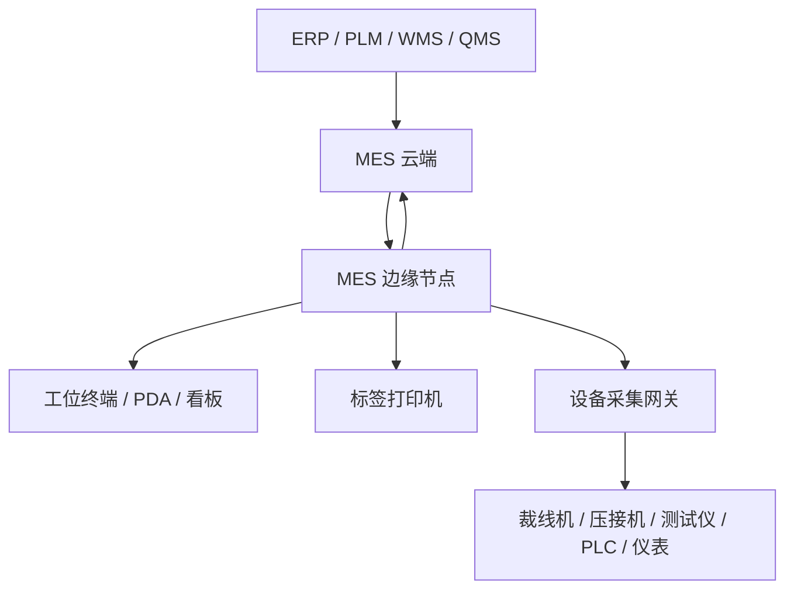

# 00 · MES 系统总览与功能地图

**状态：综合总览 / 基线深化**

本文是线束 MES 新项目的系统级总览，用来回答三个问题：

1. MES 系统到底覆盖哪些业务能力；
2. MES 与 ERP、WMS、PLM、QMS、设备系统的边界在哪里；
3. 后续 PRE-01 ～ PRE-25 每一份预研分别落在系统全景的哪个位置。

## 1. 项目定位

本项目是面向线束制造行业的 MES（Manufacturing Execution System，制造执行系统）产品，核心目标不是替代 ERP、WMS、PLM 或 QMS，而是把“计划下达到生产完成”之间的现场执行过程数字化、可防错、可追溯、可分析。

MES 关注的是车间现场已经发生、正在发生、即将发生的生产事实：

- 哪个工单在生产；
- 哪个工序正在执行；
- 哪个产品 SN 或半成品批次经过了哪些工位；
- 谁操作、什么时候操作、用了什么物料批次；
- 设备采集到了什么参数、报警或质量结果；
- 检验是否合格，不合格如何处置；
- 异常如何响应、停线多久、原因是什么；
- 完工后如何回传 ERP，如何形成追溯链。

核心价值：

- 工单执行透明化；
- 工艺路线与工序流转可控；
- 扫码、防错、报工、检验在线化；
- 物料批次、设备参数、人员、工位、时间进入生产履历；
- 原材料批次到成品 SN 的正反向追溯；
- 质量数据在线闭环；
- 断网不停产；
- 多工厂集中治理；
- 设备逐步联网，形成自动采集与闭环控制能力。

## 2. 产品边界

### 2.1 MES 负责什么

MES 负责生产现场执行：

- 工单接收、发布、派工、开工、暂停、完工；
- 工艺路线版本和工单工艺实例；
- 工序流转、防跳站、防漏工序；
- 工位扫码、SN 绑定、批次绑定；
- 生产报工、良品/不良/报废/返工数量；
- 物料上线、投料、换批、消耗、退料；
- 首检、巡检、终检、过程检验；
- 不良记录、返工、返修、报废、特采/让步放行；
- 标签打印、重打、包装标签；
- 设备状态、报警、参数、测试结果采集；
- 生产事件、质量记录、追溯关系；
- 异常、Andon、停线处理；
- 现场看板、产量、节拍、质量、异常统计；
- ERP 完工、物料消耗、质量结果等接口回传。

### 2.2 MES 不负责什么

MES 不替代以下系统：

| 系统 | 主要职责 | MES 边界 |
|---|---|---|
| ERP | 销售订单、采购、财务库存账、成本、主计划 | MES 接收工单和主数据，回传完工、消耗、质量等执行结果 |
| WMS | 库位、库存移动、收发存、仓储作业 | MES 只管理生产现场物料事实，不做完整库存账 |
| PLM / 工艺系统 | 产品设计、工程 BOM、图纸、工艺源头数据 | MES 接收可生产版本，并固化工单工艺实例 |
| QMS | 企业级质量体系、供应商质量、客户质量、8D | MES 处理生产现场质量执行和不合格品闭环 |
| APS | 高级排程算法、产能优化 | MES 阶段一支持人工排产和基础资源模型，后续再演进 APS |
| IoT 平台 | 大规模设备连接、设备遥测平台化 | MES 阶段二采用边缘设备采集网关，不急于建设独立 IoT 中台 |

## 3. 用户角色

| 角色 | 关注点 | 典型功能 |
|---|---|---|
| 操作工 | 当前做什么、扫什么码、是否合格 | 工位任务、扫码开工、报工、检验录入、异常上报 |
| 班组长 | 产线进度、异常、人员、质量 | 派工、看板、异常处理、返工确认、现场协调 |
| 工艺员 | 工序、路线、参数、SOP | 工艺路线维护、版本发布、工艺变更、SOP 管理 |
| 质检员 | 检验任务、不良处置、质量记录 | 首检、巡检、终检、不良判定、复检、放行 |
| 计划员 | 工单、排产、交期、资源 | 工单接收、生产排程、产能检查、计划调整 |
| 仓库/物料员 | 备料、上线、换批、退料 | 物料上线、批次扫码、换批、余料退回 |
| 设备员 | 设备状态、报警、维护 | 设备档案、状态监控、报警、点检、维修记录 |
| 管理者 | 产量、效率、质量、交付 | 经营看板、趋势分析、跨工厂对比 |
| 实施/运维 | 部署、升级、同步、故障 | 边缘节点管理、配置发布、日志、告警、远程升级 |
| 系统管理员 | 组织、权限、审计、安全 | 用户、角色、数据权限、审计日志、系统配置 |

## 4. 总体逻辑架构



### 4.1 云端职责

云端负责集中治理和跨工厂能力：

- 租户、组织、工厂、车间、产线、工位管理；
- 产品、物料、BOM、设备、人员等主数据；
- 工艺路线模板、工序库、参数规范、SOP；
- 工单计划、生产排程、工单下发；
- 多工厂权限、数据隔离、审计；
- ERP / WMS / PLM / QMS 集成；
- 生产历史归档、跨工厂分析、管理报表；
- 边缘节点注册、健康监控、远程升级、配置发布。

### 4.2 边缘职责

边缘负责生产现场确定性执行：

- 工位扫码、防错、工序流转；
- 本地工单和工艺实例执行；
- 本地物料批次绑定和质量记录；
- 设备数据采集、标准化和缓存；
- 标签打印；
- 本地看板；
- 本地权限缓存；
- 生产事件本地落盘；
- 断网不停产；
- 网络恢复后同步云端。

### 4.3 数据所有权

| 数据类型 | 原件 | 副本 | 原则 |
|---|---|---|---|
| 主数据 | 云端 | 边缘 | 云端发布版本，边缘只执行已发布版本 |
| 工艺模板 | 云端 | 边缘 | 发布后不可随意覆盖在制工单 |
| 工单计划 | 云端 / ERP | 边缘 | 已开工工单受生产状态保护 |
| 生产事件 | 边缘 | 云端 | 边缘产生原件，云端保存副本和索引 |
| 质量记录 | 边缘 | 云端 | 现场先闭环，再同步分析 |
| 设备原始数据 | 边缘 / 设备网关 | 云端归档 | 保留 raw_ref，支持复核 |
| 配置包 | 云端 | 边缘 | 版本化发布，可回滚 |

避免同一业务对象在云端和边缘同时写，减少冲突和停产风险。

## 5. 边缘 MES 应用功能

边缘 MES 应用部署在工厂现场，目标是保障生产不停、操作简单、响应确定。它面向操作工、班组长、质检员、物料员、设备员和现场实施人员，重点不是“集中管理”，而是“把现场每一步做对、记住、能恢复”。

边缘 MES 应用建议由以下运行单元组成：

```text
mes-edge-app
  ├─ 工位执行端
  ├─ 现场管理端
  ├─ 实施配置端
  ├─ 现场看板端
  ├─ 标签打印服务
  ├─ device-gateway
  ├─ sync-agent
  └─ update-agent
```

### 5.1 边缘首页 / 现场驾驶舱

边缘首页用于现场快速判断“今天生产是否正常”。

功能点：

- 当前边缘节点状态；
- 当前工厂、车间、产线、班次；
- 今日工单数量；
- 进行中工单；
- 待开工工单；
- 已完工工单；
- 延误工单；
- 今日计划数量；
- 今日完成数量；
- 今日良品数量；
- 今日不良数量；
- 当前良率；
- 产线运行状态；
- 工位在线状态；
- 设备在线状态；
- 打印机在线状态；
- 扫码枪在线状态；
- 待处理异常；
- 待同步事件数量；
- 最老待同步事件时间；
- 当前网络状态；
- 边缘服务健康状态。

### 5.2 工位执行端

工位执行端是操作工每天使用最多的界面。它应该是低学习成本、高防错、少输入、多扫码。

功能点：

- 工位登录；
- 员工刷卡/扫码登录；
- 工位任务列表；
- 当前工单显示；
- 当前产品信息；
- 当前工序信息；
- 工艺参数显示；
- SOP 查看；
- 图纸/图片/视频查看；
- 工序开工；
- 工序暂停；
- 工序恢复；
- 工序完工；
- SN 扫码；
- 半成品码扫码；
- 物料批次扫码；
- 工装/模具扫码；
- 设备扫码绑定；
- 防跳站校验；
- 防漏工序校验；
- 物料防错；
- 工装防错；
- 人员技能校验；
- 工艺版本校验；
- 良品报工；
- 不良报工；
- 报废报工；
- 返工入口；
- 检验结果录入；
- 设备结果自动带入；
- 标签打印触发；
- 工位异常上报；
- 离线生产提示；
- 操作日志本地记录。

### 5.3 班组长 / 产线操控台

产线操控台用于班组长和现场主管控制生产节奏。这里的“操控”不是直接控制设备动作，而是控制工单、工位、异常、人员和生产状态。

功能点：

- 产线工单队列；
- 工单开工确认；
- 工单暂停；
- 工单恢复；
- 工单完工确认；
- 工单临时调整；
- 工序派工；
- 工位任务调整；
- 工位启用/停用；
- 人员换岗；
- 班次切换；
- 工单优先级调整；
- 工单冻结/解冻申请；
- 异常确认；
- 异常分派；
- 停线确认；
- 恢复生产确认；
- 返工任务下发；
- 不良品隔离确认；
- 标签补打审批；
- 现场物料缺料确认；
- 换线/换型确认；
- 今日生产进度查看；
- 工位负荷查看；
- 人员作业状态查看。

### 5.4 现场实施看板

现场实施看板面向实施人员、工厂 IT、运维和项目负责人，用于上线前配置检查、上线中问题定位、上线后稳定性观察。它很重要，有点像现场版“飞行仪表盘”，能让实施不靠猜。

功能点：

- 工厂初始化进度；
- 车间/产线/工位配置完成度；
- 工位终端绑定状态；
- 扫码枪绑定状态；
- 打印机绑定状态；
- 设备绑定状态；
- 工艺路线下发状态；
- 工单下发状态；
- 主数据同步状态；
- 配置包版本；
- 配置包下发状态；
- 边缘应用版本；
- sync-agent 版本；
- update-agent 版本；
- device-gateway 版本；
- 本地数据库状态；
- 本地磁盘使用率；
- 本地 CPU / 内存使用率；
- 网络连通性；
- 云端连接状态；
- ERP 接口连通性；
- 打印测试；
- 扫码测试；
- 设备连通测试；
- 工位试生产检查；
- 标签模板验证；
- 质量项目验证；
- 待处理实施问题；
- 上线检查清单；
- 验收检查清单。

### 5.5 现场看板

现场看板面向产线大屏、班组看板和管理巡检，重点是“让问题暴露在现场”。

功能点：

- 产线总览看板；
- 工单进度看板；
- 工位状态看板；
- 设备状态看板；
- 设备报警看板；
- 异常 Andon 看板；
- 质量看板；
- 不良排行；
- 产量达成率；
- 节拍达成率；
- 停线时长；
- 缺料提示；
- 待检验任务；
- 待返工任务；
- 待同步事件；
- 当前班次产量；
- 小时产量；
- 工单预计完成时间；
- 现场滚动通知。

### 5.6 本地工单执行

边缘需要保存可执行工单，而不是每一步都依赖云端。

功能点：

- 接收云端下发工单；
- 工单本地缓存；
- 工单工艺实例缓存；
- 工单物料需求缓存；
- 工单状态本地流转；
- 工序状态本地流转；
- 工单开工；
- 工单暂停；
- 工单恢复；
- 工单完工；
- 工单异常挂起；
- 已开工工单保护；
- 工单取消冲突提示；
- 离线工单继续执行；
- 网络恢复后补传工单事件。

### 5.7 本地质量执行

现场质量动作应优先在边缘闭环，避免网络问题影响检验和放行。

功能点：

- 本地检验任务；
- 首检录入；
- 巡检录入；
- 完工检录入；
- 导通测试结果接收；
- 拉力测试结果接收；
- 压接参数接收；
- 自动判定；
- 人工复判；
- 不良记录；
- 不良代码选择；
- 缺陷位置记录；
- 返工申请；
- 返工执行；
- 复检；
- 质量冻结；
- 质量放行；
- 本地质量记录缓存；
- 质量记录同步云端。

### 5.8 本地物料执行

边缘要管理生产现场“用了什么”，但不承担 ERP 库存账。

功能点：

- 工单物料需求展示；
- 物料上线确认；
- 物料批次扫码；
- 投料记录；
- 换批记录；
- 补料记录；
- 退料记录；
- 消耗记录；
- 替代料校验；
- 物料有效期校验；
- 物料与 SN 绑定；
- 物料与工序绑定；
- 物料防错；
- 缺料异常；
- 消耗事件同步。

### 5.9 本地标签打印

标签打印必须尽量本地完成，不能因为云端网络波动影响生产节奏。

功能点：

- 本地标签模板缓存；
- 工位打印；
- 工序流转标签打印；
- 半成品标签打印；
- 成品 SN 标签打印；
- 包装标签打印；
- 不良标签打印；
- 返工标签打印；
- 补打；
- 重打审批校验；
- 打印机状态检测；
- 打印失败重试；
- 打印记录本地落盘；
- 打印记录同步云端。

### 5.10 设备采集与现场控制边界

边缘可以采集设备数据，也可以在成熟阶段做有限控制，但必须明确边界。

功能点：

- 设备在线状态；
- 设备运行/停机状态；
- 设备报警；
- 设备计数；
- 工艺参数采集；
- 质量结果采集；
- 曲线/文件采集；
- Modbus 点位采集；
- RS232/RS485 数据采集；
- TCP/ASCII 数据采集；
- OPC UA 数据采集；
- 文件监听；
- 设备事件本地缓存；
- 设备事件与工单绑定；
- 设备事件与工序绑定；
- 设备事件与 SN 绑定；
- 设备断线告警；
- 设备恢复告警；
- 配方下发预留；
- 工单下发预留；
- 互锁控制预留；
- 人工旁路机制；
- 设备控制审计。

### 5.11 边缘同步与离线

离线不是异常分支，而是边缘 MES 的基本能力。

功能点：

- 主数据版本缓存；
- 工艺版本缓存；
- 工单缓存；
- 权限缓存；
- 配置缓存；
- 生产事件本地队列；
- 质量记录本地队列；
- 设备事件本地队列；
- 标签记录本地队列；
- 同步重试；
- 幂等去重；
- 断点续传；
- 网络恢复自动补传；
- 同步失败告警；
- 同步冲突提示；
- 最老待同步事件显示；
- 离线生产风险提示。

### 5.12 边缘本地系统管理

边缘现场也需要基本管理能力，但这些能力应围绕生产可用性展开。

功能点：

- 边缘节点信息；
- 服务状态查看；
- mes-app 状态；
- sync-agent 状态；
- update-agent 状态；
- device-gateway 状态；
- 本地数据库状态；
- 本地磁盘空间；
- 日志查看；
- 日志导出；
- 网络诊断；
- 云端连接测试；
- ERP 连接测试；
- 打印服务测试；
- 设备连接测试；
- 本地备份；
- 本地恢复；
- 安全退出；
- 现场维护模式。

## 6. 云端 MES 管理平台功能

云端 MES 管理平台负责集中治理、跨工厂管理、主数据、配置发布、运维监控和经营分析。它不承担每一次扫码和每一次现场判定的实时依赖，否则云端波动会直接变成停产风险。

### 6.1 云端首页 / 管理驾驶舱

功能点：

- 多工厂生产总览；
- 今日计划数量；
- 今日完成数量；
- 工单达成率；
- 工厂产量排行；
- 产线状态分布；
- 质量良率趋势；
- 不良 Pareto；
- 异常数量趋势；
- 停线时长；
- 设备在线率；
- 边缘节点在线率；
- 待同步事件总数；
- ERP 接口成功率；
- 关键告警；
- 待审批事项；
- 待处理实施问题。

### 6.2 组织与多工厂管理

功能点：

- 租户管理；
- 工厂管理；
- 车间管理；
- 产线管理；
- 工位管理；
- 班组管理；
- 班次日历；
- 工作日历；
- 多工厂数据隔离；
- 跨工厂授权；
- 工厂启停用；
- 工厂参数模板；
- 工厂复制初始化；
- 组织变更审计。

### 6.3 主数据中心

功能点：

- 产品档案；
- 产品版本；
- 物料档案；
- 物料分类；
- BOM 管理；
- 替代料管理；
- 客户项目管理；
- 供应商批次属性；
- 设备档案；
- 工装/模具/治具档案；
- 检具档案；
- 人员档案；
- 技能矩阵；
- 不良代码；
- 报警代码；
- 字典管理；
- 编码规则；
- 主数据导入；
- 主数据校验；
- 主数据发布；
- 主数据版本追踪。

### 6.4 工艺中心

功能点：

- 工序库；
- 工序分类；
- 工序能力标签；
- 工艺路线模板；
- 路线版本；
- 工序关系配置；
- 并行/分支/返工路线；
- 工艺参数规范；
- SOP 管理；
- 工序检验规则；
- 工序标签规则；
- 工序设备要求；
- 工序工装要求；
- 工序人员技能要求；
- 工艺版本发布；
- 工艺变更审批；
- 工艺版本下发；
- 在制影响分析。

### 6.5 计划与工单中心

功能点：

- ERP 工单接收；
- 手工工单；
- 试制工单；
- 工单审核；
- 工单发布；
- 工单下发边缘；
- 工单取消；
- 工单变更；
- 已开工工单变更拦截；
- 工单优先级；
- 工单齐套检查；
- 工单拆分；
- 工单合并建议；
- 工单进度查询；
- 工单状态跟踪；
- 工单完工确认；
- 工单关闭；
- 工单履历。

### 6.6 排产管理

功能点：

- 产线日历；
- 班次产能；
- 工位能力；
- 设备能力；
- 人员技能；
- 模具/治具约束；
- 标准工时；
- 换型时间；
- 手工排产；
- 拖拽排程；
- 工单排序；
- 产能负荷；
- 资源冲突提示；
- 延误预警；
- 排产版本；
- 排产发布；
- APS 接口预留。

### 6.7 质量管理中心

功能点：

- 检验计划；
- 检验标准；
- 检验项目；
- 抽检规则；
- 首检规则；
- 巡检规则；
- 完工检规则；
- 不良代码；
- NCR 管理；
- 返工流程；
- 返修流程；
- 报废确认；
- 特采/让步放行审批；
- 质量冻结；
- 质量放行；
- 质量统计；
- 不良 Pareto；
- 工序良率；
- 客诉追溯；
- 质量记录归档。

### 6.8 追溯中心

功能点：

- SN 查询；
- 工单履历查询；
- 工序履历查询；
- 物料批次履历；
- 设备参数履历；
- 质量结果履历；
- 标签履历；
- 人员操作履历；
- 正向追溯；
- 反向追溯；
- Genealogy 图谱；
- 影响范围分析；
- 问题批次召回分析；
- 客诉 SN 分析；
- 追溯报告导出。

### 6.9 设备与网关管理

功能点：

- 设备档案；
- 设备能力模型；
- 设备与工位绑定；
- 设备协议类型；
- 设备点位模板；
- 点位映射；
- 设备采集配置；
- device-gateway 注册；
- Adapter 插件管理；
- Modbus 配置；
- RS232/RS485 配置；
- TCP/ASCII 配置；
- OPC UA 配置；
- 文件采集配置；
- 设备在线率；
- 设备报警；
- 设备事件查询；
- 设备原始数据引用；
- 设备配置下发；
- 设备接入调试记录。

### 6.10 标签中心

功能点：

- 标签模板管理；
- 标签版本；
- 产品标签规则；
- 半成品标签规则；
- 成品标签规则；
- 包装标签规则；
- 客户标签规则；
- 工位打印规则；
- 打印机档案；
- 打印机分配；
- 打印记录；
- 补打记录；
- 重打审批；
- 标签预览；
- 标签测试打印；
- 标签发布边缘。

### 6.11 异常与 Andon 中心

功能点：

- 异常分类；
- 异常等级；
- 响应规则；
- 责任部门；
- 通知规则；
- 异常工单；
- 停线记录；
- 处理过程；
- 原因分析；
- 关闭确认；
- 异常升级；
- 超时提醒；
- MTTA；
- MTTR；
- 异常趋势；
- 停机损失分析。

### 6.12 云边运维中心

功能点：

- 边缘节点注册；
- 边缘节点列表；
- 边缘节点拓扑；
- 边缘在线状态；
- mes-app 状态；
- sync-agent 状态；
- update-agent 状态；
- device-gateway 状态；
- CPU / 内存 / 磁盘；
- 本地数据库健康；
- 待同步事件；
- 最老待同步事件；
- 同步吞吐；
- 同步失败；
- 日志回传；
- 远程诊断；
- 远程升级；
- 升级计划；
- 灰度发布；
- 自动回滚；
- 版本分布；
- 边缘备份状态；
- 整机替换恢复记录。

### 6.13 配置发布中心

功能点：

- 工厂配置包；
- 工位配置包；
- 工艺配置包；
- 标签配置包；
- 设备点位配置包；
- ERP 映射配置包；
- 扫码规则；
- 防错规则；
- 字典配置；
- 功能开关；
- 配置版本；
- 配置比对；
- 配置审批；
- 配置发布；
- 配置回滚；
- 边缘接收确认；
- 配置生效记录。

### 6.14 集成中心

功能点：

- ERP Adapter；
- WMS Adapter；
- PLM Adapter；
- QMS Adapter；
- IoT Adapter；
- 接口配置；
- 字段映射；
- 编码映射；
- 接口认证；
- 接口日志；
- 接口重试；
- 失败队列；
- 手工补偿；
- 接口对账；
- 接口健康监控；
- Webhook；
- 文件导入导出；
- API 文档。

### 6.15 权限、安全与审计中心

功能点：

- 用户管理；
- 角色管理；
- 岗位管理；
- 菜单权限；
- 功能权限；
- 数据权限；
- 工厂权限；
- 产线权限；
- 工位权限；
- 审批权限；
- API 访问凭证；
- 边缘节点证书；
- 设备接入凭证；
- 登录审计；
- 操作审计；
- 数据变更审计；
- 工艺发布审计；
- 工单变更审计；
- 标签重打审计；
- 质量放行审计；
- 设备控制审计；
- 安全告警。

### 6.16 实施管理平台

云端实施管理平台用于把首家客户经验沉淀为可复制上线方法。

功能点：

- 客户项目档案；
- 实施阶段管理；
- 工厂调研表；
- 设备调研表；
- 工艺调研表；
- BOM 调研表；
- ERP 接口调研表；
- 标签调研表；
- 数据导入模板；
- 初始化任务清单；
- 工厂初始化；
- 产线初始化；
- 工位初始化；
- 用户权限初始化；
- 设备绑定初始化；
- 标签模板初始化；
- 配置包生成；
- 配置包下发；
- 上线检查清单；
- 试生产记录；
- 问题清单；
- 整改跟踪；
- 验收记录；
- 实施知识库。

### 6.17 云端报表与分析

功能点：

- 工单达成分析；
- 产量趋势；
- 产线效率；
- 工位效率；
- 工序良率；
- 产品良率；
- 不良 Pareto；
- 返工率；
- 报废率；
- 停机分析；
- 异常分析；
- 设备在线率；
- 设备报警排行；
- 物料消耗分析；
- 批次影响分析；
- 客诉追溯分析；
- 跨工厂对比；
- 数据导出；
- 管理驾驶舱。

## 7. MES 功能全景

### 7.1 组织与基础设置

组织模型用于支撑多工厂、多车间、多产线、多工位的权限、数据隔离和现场配置。

功能点：

- 租户管理；
- 工厂管理；
- 车间管理；
- 产线管理；
- 工位管理；
- 班组管理；
- 班次日历；
- 工作日历；
- 工厂参数；
- 工位终端绑定；
- 扫码枪、打印机、设备与工位绑定；
- 组织启停用；
- 多工厂数据隔离；
- 跨工厂查询授权。

### 7.2 主数据管理

主数据是 MES 执行的基础，原则上云端为主，边缘保存版本化副本。

功能点：

- 产品档案；
- 产品版本；
- 物料档案；
- 物料分类；
- 线材、端子、连接器、胶带、辅料等线束物料属性；
- BOM 管理；
- 工程 BOM 与制造 BOM 映射；
- 替代料规则；
- 供应商批次属性；
- 客户、项目、车型、平台信息；
- 设备档案；
- 模具、治具、检具档案；
- 员工档案；
- 人员技能矩阵；
- 不良代码；
- 报警代码；
- 单位、字典、编码规则。

### 7.3 工艺路线与工序配置

线束 MES 不应把 7 道标准工序写死，而应采用工序库、路线模板、版本发布、工单实例的模式。

功能点：

- 工序库；
- 工序分类；
- 工序能力标签；
- 工艺路线模板；
- 路线版本管理；
- 工序前后关系；
- 分支、并行、返工路线；
- 工序参数规范；
- 工序 SOP；
- 工序所需设备、工装、技能要求；
- 工序检验要求；
- 工序标签打印要求；
- 工序防错规则；
- 工艺版本发布；
- 工艺变更审批；
- 在制工单工艺版本锁定；
- 工单工艺实例生成。

### 7.4 生产计划与工单管理

工单是 MES 执行主线，但 MES 不应在早期就做复杂 APS。第一阶段重点是把 ERP 工单转成可执行、可追溯、可防错的现场任务。

功能点：

- ERP 工单接收；
- 手工创建试制工单；
- 工单拆分；
- 工单合并建议；
- 工单发布；
- 工单取消；
- 工单变更控制；
- 工单优先级；
- 工单交期；
- 工单数量；
- 工单物料需求；
- 工单工艺实例；
- 工单派工；
- 工单冻结/解冻；
- 工单齐套检查；
- 工单状态机；
- 工单完工；
- 工单关闭；
- ERP 完工回传。

### 7.5 排产与资源能力

阶段一不做复杂算法，但要预留排产所需资源模型。

功能点：

- 生产日历；
- 班次产能；
- 产线能力；
- 工位能力；
- 设备能力；
- 人员技能；
- 模具/治具约束；
- 标准工时；
- 换型时间；
- 工序节拍；
- 人工拖拽排产；
- 工单排产看板；
- 产能负荷视图；
- 计划调整记录；
- 延误预警；
- APS 接口预留。

### 7.6 工位执行

工位执行是 MES 的主体验。操作工看到的不是“系统功能”，而是当前工位应该做什么、扫什么、是否允许继续。

功能点：

- 工位登录；
- 工位任务列表；
- 扫码开工；
- SN 扫码；
- 物料批次扫码；
- 工装/模具扫码；
- 人员资质校验；
- 工序防跳站；
- 工序防漏扫；
- 工艺参数显示；
- SOP 查看；
- 工序开始、暂停、恢复、完成；
- 良品报工；
- 不良报工；
- 报废报工；
- 返工入口；
- 工位异常上报；
- 设备数据自动带入；
- 标签打印触发；
- 离线继续生产；
- 本地缓存和补传。

### 7.7 生产事件模型

生产事实建议事件化，避免靠大量 UPDATE 覆盖历史。

功能点：

- 工单事件；
- 工序事件；
- 扫码事件；
- 投料事件；
- 消耗事件；
- 报工事件；
- 检验事件；
- 不良事件；
- 返工事件；
- 设备采集事件；
- 标签打印事件；
- 异常事件；
- 人员操作事件；
- 云边同步事件；
- 事件幂等；
- 事件重放；
- 事件补传；
- 事件审计。

### 7.8 物料执行

MES 不替代 ERP/WMS 的库存账，但必须管理生产现场物料事实。

功能点：

- 工单物料需求；
- 备料确认；
- 物料上线；
- 批次扫码；
- 投料；
- 换料；
- 换批；
- 补料；
- 退料；
- 消耗；
- 损耗；
- 余料；
- 替代料；
- 超领提示；
- 批次有效期校验；
- 供应商批次追溯；
- SN 与物料批次关联；
- 消耗回传 ERP。

### 7.9 质量管理

质量管理要形成生产现场闭环，而不是只保存检验结果。

功能点：

- 检验计划；
- 检验标准；
- 检验项目；
- 检验频次；
- 首检；
- 巡检；
- 过程检；
- 完工检；
- 导通测试；
- 拉力测试；
- 压接高度检测；
- 压接压力曲线记录；
- 检验任务；
- 检验记录；
- 自动判定；
- 人工判定；
- 不良记录；
- 不良代码；
- 缺陷位置；
- NCR 不合格记录；
- 返工；
- 返修；
- 报废；
- 特采/让步放行；
- 复检；
- 质量冻结；
- 质量放行；
- 质量统计。

### 7.10 追溯与 Genealogy

线束生产追溯不是简单链路，而是“物料批次、半成品、组件、成品 SN、包装单元”之间的生产谱系图。

功能点：

- SN 管理；
- 半成品批次；
- 成品批次；
- 包装箱号；
- 批次拆分；
- 批次合并；
- 原材料批次关联；
- 端子批次关联；
- 线材批次关联；
- 连接器批次关联；
- 胶带/辅料批次关联；
- 工序履历；
- 人员履历；
- 工位履历；
- 设备履历；
- 参数履历；
- 质量履历；
- 标签履历；
- 正向追溯；
- 反向追溯；
- 影响范围分析；
- 客诉 SN 追溯；
- 问题物料批次召回分析。

### 7.11 设备接入

设备接入采用“设备 → 边缘设备采集网关 → MES”的架构，MES 不直接承担所有协议。

功能点：

- 设备档案；
- 设备能力模型；
- 设备与工位绑定；
- 设备状态采集；
- 设备报警采集；
- 设备计数采集；
- 工艺参数采集；
- 质量结果采集；
- 曲线/报告文件采集；
- OPC UA 适配；
- REST 适配；
- MQTT 适配；
- WPCS / 厂商接口适配；
- RS232 / RS485 适配；
- Modbus RTU/TCP 适配；
- TCP/ASCII 适配；
- 文件导出采集；
- 私有协议/SDK 封装；
- 老旧设备 I/O 改造；
- 串口联网模块接入；
- 旁路传感；
- 设备数据统一模型 UDM；
- 设备数据与工单/SN 绑定；
- 设备数据质量位；
- 设备断线重连；
- 设备原始数据归档。

### 7.12 标签打印

标签体系既服务生产执行，也服务追溯和客户交付。

功能点：

- 标签模板；
- 产品标签；
- 半成品标签；
- 成品 SN 标签；
- 包装箱标签；
- 工序流转标签；
- 物料标签；
- 不良标签；
- 返工标签；
- 客户标签；
- 打印规则；
- 工位打印；
- 批量打印；
- 补打；
- 重打审批；
- 打印记录；
- 标签内容版本；
- 打印机绑定；
- 打印失败重试；
- ZPL/TSPL/Windows Driver 支持。

### 7.13 异常 / Andon / 停线

真实车间每天发生大量异常，MES 必须能记录、响应、升级和复盘。

功能点：

- 异常分类；
- 缺料异常；
- 设备异常；
- 质量异常；
- 工艺异常；
- 人员异常；
- 模具/治具异常；
- 来料异常；
- 扫码异常；
- 测试失败；
- 停线申请；
- Andon 呼叫；
- 响应人；
- 责任部门；
- 处理措施；
- 恢复生产；
- 原因分析；
- 异常关闭；
- 异常升级；
- 停机时长统计；
- MTTA / MTTR 指标；
- 异常趋势分析。

### 7.14 看板与报表

看板服务现场即时管理，报表服务复盘和改善。

功能点：

- 工单进度看板；
- 产线状态看板；
- 工位状态看板；
- 设备状态看板；
- 异常看板；
- 质量看板；
- 产量日报；
- 工序良率；
- 不良 Pareto；
- 停机分析；
- 节拍分析；
- 工时分析；
- 物料消耗分析；
- 追溯查询报表；
- ERP 回传状态；
- 边缘同步状态；
- 跨工厂对比。

### 7.15 ERP 集成

ERP 集成要可靠，但不能因为接口失败阻塞现场生产。

功能点：

- 产品主数据同步；
- 物料主数据同步；
- BOM 同步；
- 工单同步；
- 工单变更同步；
- 完工回传；
- 报废回传；
- 物料消耗回传；
- 退料回传；
- 质量结果回传；
- 接口幂等；
- 接口重试；
- 接口补偿；
- 接口对账；
- 失败队列；
- ERP Adapter；
- ERP 差异化映射；
- 首家客户 ERP 验证。

### 7.16 外围系统集成

功能点：

- WMS 备料/领料/退料接口；
- PLM / 工艺系统产品版本接口；
- QMS 不良和质量闭环接口；
- IoT 平台设备遥测接口；
- 条码系统接口；
- 客户标签系统接口；
- 文件导入导出；
- Webhook；
- API 网关；
- 集成日志；
- 集成监控；
- 集成重放。

### 7.17 权限、安全与审计

功能点：

- 用户管理；
- 角色管理；
- 菜单权限；
- 功能权限；
- 数据权限；
- 工厂级权限；
- 产线级权限；
- 工位级权限；
- 离线权限缓存；
- 操作审计；
- 登录审计；
- 工艺发布审计；
- 工单变更审计；
- 标签重打审计；
- 质量放行审计；
- 设备控制审计；
- API 认证；
- 边缘节点身份；
- 证书管理；
- 密钥轮换；
- 升级包签名。

### 7.18 配置中心

功能点：

- 工厂配置；
- 工位配置；
- 打印配置；
- 扫码规则；
- 标签规则；
- 防错规则；
- 设备点位配置；
- ERP 映射配置；
- 字典配置；
- 编码规则；
- 功能开关；
- 配置包生成；
- 配置发布；
- 配置版本；
- 配置回滚；
- 边缘配置同步。

### 7.19 云边同步

功能点：

- 主数据云到边缘发布；
- 工艺版本云到边缘发布；
- 工单云到边缘下发；
- 配置云到边缘发布；
- 生产事件边缘到云同步；
- 质量记录边缘到云同步；
- 设备事件边缘到云同步；
- 标签记录边缘到云同步；
- 同步队列；
- 幂等去重；
- 断点续传；
- 冲突处理；
- 同步状态监控；
- 最老待同步事件告警；
- 离线恢复。

### 7.20 边缘节点运维

功能点：

- 边缘节点注册；
- 边缘服务清单；
- mes-app 管理；
- sync-agent 管理；
- update-agent 管理；
- device-gateway 管理；
- 健康检查；
- 远程升级；
- A/B 部署；
- 自动回滚；
- 数据库迁移保护；
- 日志采集；
- 指标采集；
- 告警；
- 远程诊断；
- 整机替换恢复；
- 边缘备份。

### 7.21 数据生命周期

功能点：

- 生产事件保留策略；
- 质量记录保留策略；
- 设备原始数据保留策略；
- 曲线/报告文件归档；
- 标签记录归档；
- 操作日志归档；
- 云端冷热分层；
- 边缘本地保留周期；
- 数据压缩；
- 数据脱敏；
- 删除审批；
- 审计留痕；
- 历史追溯查询。

### 7.22 实施与初始化

功能点：

- 客户工厂调研；
- 设备清单调研；
- 工艺路线调研；
- BOM 和物料调研；
- 标签模板调研；
- ERP 接口调研；
- 组织和权限初始化；
- 工厂/车间/产线/工位初始化；
- 设备/打印机/扫码枪绑定；
- 数据导入模板；
- 配置包导入；
- 试生产验证；
- 上线检查清单；
- 培训；
- 验收；
- Zero-Touch Provisioning 演进。

## 8. 核心业务链


### 8.1 正常生产主线

```text
ERP 工单
  → MES 接收
  → 工艺版本匹配
  → 生成工单工艺实例
  → 发布到边缘
  → 工位扫码开工
  → 物料批次绑定
  → 工序执行
  → 设备参数采集
  → 检验判定
  → 标签打印
  → 完工
  → ERP 回传
```

### 8.2 不良返工主线

```text
检验 NG
  → 不良记录
  → NCR / 处置
  → 返工 / 返修 / 报废 / 特采
  → 返工路线
  → 复检
  → 放行或关闭
```

### 8.3 追溯主线

```text
物料批次
  → 投料
  → 工序事件
  → 半成品批次
  → 成品 SN
  → 包装单元
  → 客户交付
```

## 9. 核心数据对象

| 领域 | 核心对象 |
|---|---|
| Organization | Factory、Workshop、Line、Workstation、Shift |
| MasterData | Product、Material、BOM、Employee、Equipment、Tooling |
| Process | Operation、Routing、RoutingVersion、SOP、ParameterSpec |
| Production | WorkOrder、WorkOrderOperation、ProductionBatch、ProductionEvent |
| Material | MaterialBatch、Feeding、Consumption、Return、Substitution |
| Quality | InspectionPlan、InspectionRecord、Defect、NCR、Disposition、Rework |
| Traceability | ProductSN、TraceEvent、GenealogyRelation、PackageUnit |
| Equipment | Device、DeviceEvent、DeviceParameter、DeviceAlarm、Adapter |
| Integration | ErpMessage、SyncTask、InterfaceLog、RetryTask |
| Platform | User、Role、Permission、AuditLog、ConfigPackage、EdgeNode |

## 10. 预研分层

### 第一层：核心业务模型

| 编号 | 主题 | 作用 |
|---|---|---|
| PRE-01 | 工艺路线与工序配置 | 解决不同线束工艺如何灵活配置 |
| PRE-07 | 核心领域模型 | 稳定 WorkOrder、Operation、Batch、SN 等核心对象 |
| PRE-08 | Genealogy 追溯 | 建立物料到成品 SN 的图谱追溯 |
| PRE-09 | 质量闭环 | 建立检验、不良、返工、放行体系 |
| PRE-10 | 状态机 | 定义工单和工序执行状态 |
| PRE-11 | 物料执行 | 定义投料、换批、消耗、退料 |
| PRE-15 | 异常 / Andon | 定义异常响应和停线闭环 |

### 第二层：现场执行技术

| 编号 | 主题 | 作用 |
|---|---|---|
| PRE-02 | 关键技术要点 | 扫码、并发、离线、权限、性能等 |
| PRE-05 | 标签打印 | 标签模板、打印、补打、追溯 |
| PRE-06 | 设备适配 | OPC UA、Modbus、RS232、TCP、文件、私有协议等 |

### 第三层：平台架构

| 编号 | 主题 | 作用 |
|---|---|---|
| PRE-03 | 云边协同 | 定义云端和边缘的数据所有权与同步 |
| PRE-04 | 边缘远程更新 | 定义 update-agent、回滚、升级安全 |
| PRE-13 | 组织权限 | 多工厂、RBAC、数据权限 |
| PRE-16 | 可观测性 | 健康、指标、日志、告警 |
| PRE-17 | 安全体系 | 身份、证书、通信、最小权限 |
| PRE-18 | 备份灾备 | 边缘备份、整机替换、RPO/RTO |
| PRE-21 | 配置中心 | 配置包、发布、回滚、功能开关 |
| PRE-22 | 版本兼容 | 应用、数据库、插件、配置兼容 |

### 第四层：外围集成

| 编号 | 主题 | 作用 |
|---|---|---|
| PRE-12 | ERP 集成 | 工单、主数据、完工、消耗、接口可靠性 |
| PRE-14 | 计划与 APS | 资源模型、人工排产、后续高级排程 |
| PRE-19 | 外围系统边界 | WMS、PLM、QMS、IoT 等边界 |

### 第五层：产品化

| 编号 | 主题 | 作用 |
|---|---|---|
| PRE-20 | 实施初始化 | 首家客户上线、配置包、数据导入 |
| PRE-23 | 数据生命周期 | 边缘保留、云端归档、冷热分层 |
| PRE-24 | 测试验收 | 功能、离线、同步、设备、升级门禁 |
| PRE-25 | 路线图 | 预研优先级和开发阶段 |

## 11. 阶段范围建议

### 阶段 A：领域骨架

目标是先把系统骨架稳定下来。

范围：

- 组织模型；
- 产品/物料/BOM；
- 工序库；
- 工艺路线；
- 工单；
- 工单工艺实例；
- 工单/工序状态机；
- 生产事件模型；
- 基础权限。

### 阶段 B：最小生产闭环

目标是让工单能跑完，能留下基本追溯。

范围：

- 工单下发；
- 工位任务；
- 扫码开工；
- 工序防错；
- 报工；
- 基础检验；
- 标签打印；
- 完工；
- 基础追溯；
- ERP 完工回传。

### 阶段 C：边缘闭环

目标是断网不停产。

范围：

- 边缘本地数据库；
- 主数据下发；
- 工单下发；
- 生产事件本地落盘；
- sync-agent；
- 离线权限；
- 断网恢复；
- 同步监控。

### 阶段 D：现场深化

目标是覆盖真实线束生产复杂度。

范围：

- 物料批次；
- 换批追溯；
- Genealogy；
- 完整质量闭环；
- 不良处置；
- 返工返修；
- 异常 Andon；
- 现场看板；
- ERP 消耗回传。

### 阶段 E：产品化

目标是可复制实施、可远程运维。

范围：

- 远程升级；
- 配置中心；
- 实施初始化工具；
- 可观测性；
- 安全体系；
- 备份灾备；
- 数据生命周期；
- 测试验收门禁。

### 阶段 F：设备联网

目标是让设备数据进入质量和追溯链。

范围：

- Device Gateway；
- 设备能力模型；
- Modbus / RS232 / TCP/ASCII / 文件采集；
- OPC UA / REST / MQTT / WPCS；
- L1 状态采集；
- 关键设备 L2 参数回传；
- 设备事件与工单/SN 绑定。

### 阶段 G：高级能力

目标是提升效率和智能化。

范围：

- APS 高级排程；
- L3 设备闭环；
- 跨工厂分析；
- 高级质量分析；
- 预测性维护；
- IoT 平台化扩展。

## 12. 当前优先级

P0：PRE-07、PRE-08、PRE-09、PRE-10、PRE-11、PRE-12。

P1：PRE-13、PRE-15、PRE-16、PRE-17、PRE-18。

P2：PRE-14、PRE-19、PRE-20、PRE-21、PRE-22、PRE-23、PRE-24。

原因：核心业务对象如果没有稳定，后续数据库、API、云边同步、设备数据和追溯都会反复修改。先冻结领域模型，再写大规模业务代码，成本最低。

## 13. 阶段一不做什么

为了避免系统从第一天就膨胀，阶段一建议明确不做：

- 不做万能 BPM / 低代码流程引擎；
- 不做复杂 APS 自动排程；
- 不把 MES 写成设备驱动集合；
- 不替代 ERP 库存账和财务成本；
- 不替代 WMS 仓储作业；
- 不替代 PLM 工程设计；
- 不做大而全 IoT 中台；
- 不用不可回滚的数据库变更破坏边缘远程升级；
- 不为单个客户写大量专属 if/else。

## 14. 首家客户验证重点

首家客户不是单纯交付项目，而是验证 MES 产品模型。

必须验证：

- 实际工序是否能被工序库 + 路线模板表达；
- BOM 与现场物料投料是否能对应；
- 工单状态和工序状态是否足够；
- 批次切换是否能支撑追溯；
- SN、半成品、包装单元之间的 Genealogy 是否成立；
- 质量闭环是否覆盖首检、巡检、终检、不良、返工、放行；
- ERP 工单变更是否会影响边缘已开工工单；
- 设备数据是否能绑定到工单、工序、SN；
- 标签规则是否满足客户交付；
- 断网、断电、设备断线、打印失败时是否能恢复；
- 边缘远程升级是否不会影响生产。

如果首家客户发现差异，优先修正领域模型和配置能力，而不是把差异硬编码进客户专属逻辑。
