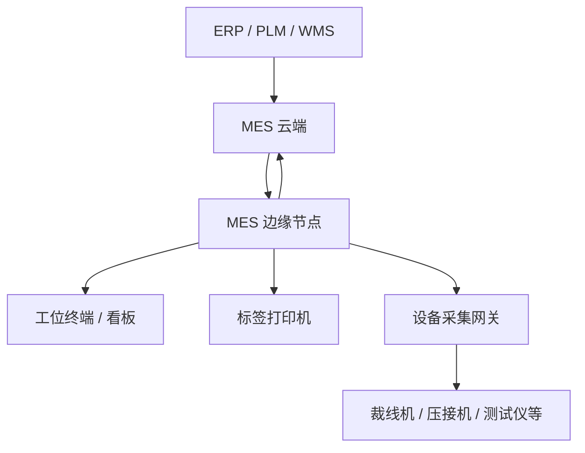

# 00 · MES 总览与预研地图

**状态：综合总览 / 基线**

## 1. 项目定位

本项目是面向线束制造行业的 MES 产品，核心目标不是替代 ERP、WMS、PLM 或 QMS，而是把“计划下达到生产完成”之间的现场执行过程数字化、可防错、可追溯、可分析。

核心价值：

- 工单执行透明化；
- 工序与物料防错；
- 质量数据在线闭环；
- 人、机、料、法、环、测形成生产履历；
- 原材料批次到成品 SN 的正反向追溯；
- 断网不停产；
- 多工厂集中治理；
- 设备逐步联网，形成自动采集与闭环控制能力。

## 2. 产品边界

MES 负责：工单执行、工艺实例、工序流转、扫码防错、生产报工、质量记录、物料现场消耗、设备事件关联、标签、追溯、异常、现场看板。

ERP 负责：销售订单、采购、财务库存账、成本、主计划等企业经营管理。

WMS 负责：库位、库存移动、收发存、仓储作业。

PLM/工艺系统负责：产品设计与工程BOM等上游工程数据；MES接收可生产版本。

## 3. 总体逻辑架构

### 云端

负责主数据、工艺版本、工单计划、跨工厂管理、历史归档、分析报表、ERP集成、版本发布、设备/边缘节点治理。

### 边缘

负责扫码、防错、报工、检验、追溯事件落盘、标签、现场看板、本地用户权限、离线运行。

### 数据所有权

- 生产事件：边缘产生原件，云端保存副本；
- 主数据：云端维护原件，边缘保存版本化副本；
- 避免同一业务对象在云边两端同时写。

## 4. 核心业务链

## 5. 预研分层

### 第一层：核心业务模型

01 工艺路线、07 领域模型、08 追溯、09 质量、10 状态机、11 物料、15 异常。

### 第二层：现场执行技术

02 扫码/并发/离线/权限/编码/性能、05 标签、06 设备接入。

### 第三层：平台架构

03 云边、04 更新、13 组织权限、16 运维、17 安全、18 灾备、21 配置、22 版本。

### 第四层：外围集成

12 ERP、14 APS、19 WMS/QMS/PLM/IoT边界。

### 第五层：产品化

20 实施、23 数据生命周期、24 测试验收、25 路线图。

## 6. 当前优先级

P0：07、08、09、10、11、12。  
P1：13、15、16、17、18。  
P2：14、19、20、21、22、23、24。

原因：核心业务对象如果没有稳定，后续数据库、API、云边同步、设备数据和追溯都会反复修改。
