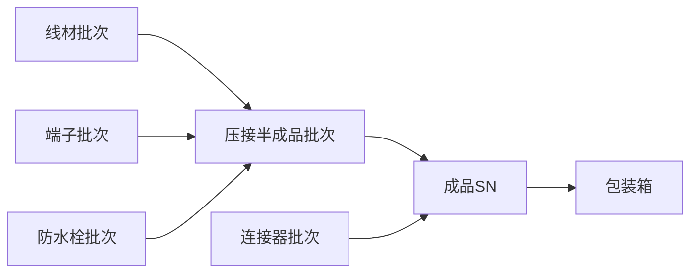

# 08 · 批次 / SN / Genealogy 全链路追溯

**状态：建议稿 / P0**

## 1. 目标

实现原材料批次 → 半成品 → 成品 SN → 包装/交付的正向追溯，以及客户投诉 SN → 工序 → 人员 → 设备 → 参数 → 物料批次 → 检验结果的反向追溯。

## 2. 为什么是图而不是单表

线束由多种物料和半成品汇聚形成，生产过程存在一对多、多对一、拆批、合批和返工，因此应以 Genealogy 关系表达谱系。

## 3. 追溯实体

- material_batch；
- production_batch；
- product_sn；
- genealogy_relation；
- production_event；
- material_consumption；
- inspection_record；
- device_event_ref；
- package_unit。

## 4. 批次切换

必须记录物料批次生效区间，不能只在工单级记录“用过哪些批次”。对连续生产，可通过 event_time / sequence 将物料批次切换与产出 SN/批次关联。

## 5. 追溯查询

### 正向

原料批次 → 使用工单/工序 → 半成品/成品 → 包装 → 交付范围。

### 反向

SN → 工单 → 路线版本 → 工序事件 → 操作人/工位/设备 → 物料批次 → 检验与过程参数。

## 6. 不可变性

原始追溯事件原则上只追加，不物理覆盖。纠错使用 correction/reversal 事件并保留原记录。

## 7. 性能

高频事件表按时间/工厂分区；Genealogy 建双向索引；常用 SN 查询建立物化摘要或缓存，但原始事件作为事实源。
