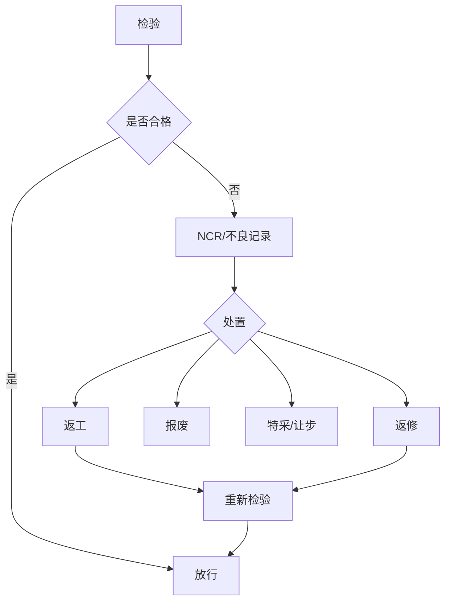

# 09 · 质量管理与不合格品闭环

**状态：建议稿 / P0**

## 1. 质量对象

InspectionPlan、InspectionItem、InspectionTask、InspectionRecord、Defect、NCR、Disposition、ReworkOrder、QualityRelease。

## 2. 检验类型

首件检验、巡检、完工检、设备自动检测、抽检、全检、返工复检。

## 3. 闭环

## 4. 过程参数与质量判定分离

设备上传的压接高度、压力曲线、拉脱力、导通、绝缘、耐压等属于测量/过程数据；最终 Pass/Fail 由版本化规格与判定规则产生。必须保留原始值、规格版本和判定结果。

## 5. 关键字段

spec_version、lower_limit、upper_limit、measured_value、unit、result、equipment_id、operator_id、event_time、source(manual/device)、retest_of。

## 6. 放行与冻结

不合格对象进入 HOLD，未经授权处置不得继续流转；特采必须具备角色权限、原因、审批人和审计记录。

## 7. 质量统计基础

一次合格率 FPY、缺陷率、返工率、报废率、工序不良 Pareto、设备/班组/产品质量趋势。
